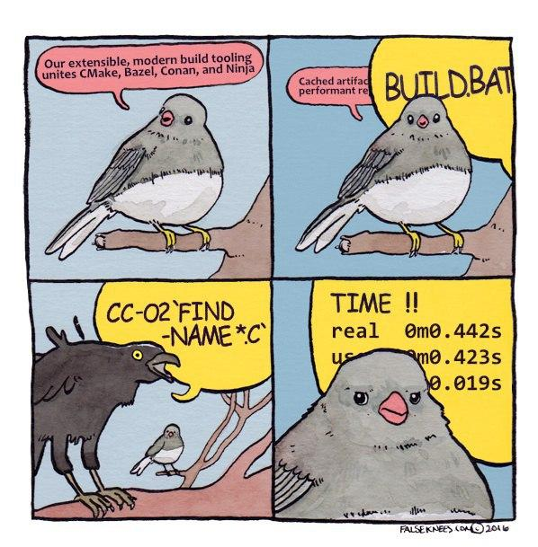

Lua binding and extension for [Raylib](https://www.raylib.com) \([git](https://github.com/raysan5/raylib)\).

Raylib-luamore is shared library for Lua and LuaJIT (current build is for LuaJIT). 

## Why?
There are several raylib-lua bindings 
([raylib-lua](https://github.com/raysan5/raylib-lua), 
[raylib-lua-sol](https://github.com/RobLoach/raylib-lua-sol), 
[raylib-lua-ffi](https://gist.github.com/alexander-matz/f8ee4eb9fdf676203d70c1e5e329a6ec)), 
but why am I making a new one?
There are several reasons:
* Primarily, this is the Lua library. Any Lua application can require it (I tried to use it with [LÖVE](https://love2d.org) creating two graphics windows with stuff rendering inside Lua: for raylib and LÖVE), also static linked.
* Comfort of use. I love Lua, and I like Lua programming archetype. I don't like global variables but I like to use objects, like `newvec = vecA + vecB` or `vecA:add(vecB)`. Also Lua can return multiple values but C doesn't. And I add extensions for use inside the lua. Here some metamethods for objects and new functions that combines calls, keeping the original api, stored in one (local) table;
* Sometimes passing objects by value can do a lot of unnecessary things, especially in math. And when to rotate the matrix, we should to create three matrices (translate, rotate and scale), and then multiply them, creating a new matrix every time - this is not very good. And if on the C side it can be stored on the stack, then when using lua we need to allocate RAM every time, and the process slows down.
* I seem to be able to support the library in the future: every existed binding is now outdated(?) these words may also be outdated.

## Documentation
Current binding is for Raylib v3.0. Source code is self-documented, but the extracted documentation is located in [Doc](doc) directory.
Functions is located in `main.c` file, classes in `classes.h`.

## Building

Currently this project is for Windows and LuaJIT. So just run `build.bat` if you are adding some features.
Rebuilding the Raylib library is done using `include/raylib/build_objects.bat` (`lib/raylib.a` will updated).

## External stuff
This package provides with Raylib source, [LuaJITx86 2.1.0-beta2](http://luajit.org) and [TCC v0.9.27](https://bellard.org/tcc/) binaries for easier compiling and running.

## Binaries
Check [Build](build)

## Examples
Check [Examples](build/examples) (Lua scripts can be drag-and-dropped to `run_example.bat`)

## Todo:
* Finish main api;
* Add Physac;
* Add [Raygui](https://github.com/raysan5/raygui);
* Add several additional modules.

## License
Raylib-luamore is licensed under an zlib/libpng license.
*Copyright (c) 2020~2xxx [Snusmumriken](@HDPLocust)
